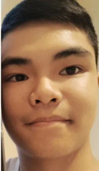

<html lang="en">
<head>
    <meta charset="UTF-8">
    <meta name="viewport" content="width=device-width, initial-scale=1.0">
    
</head>
<body>
    
 
        <h1>Family and Nationality</h1>
        

            
I live with two parents and an older sibling, who graduated from Del Norte and now attends community college. Both of my parents are Vietnamese immigrants, who moved into the U.S around the late 1900s. The vast majority of my immediate family lives in Seattle, Washington, whom we visit at least once a year.

            
        

        <h1>Future Plans</h1>
        

            
I plan on pursuing a career in electrical engineering. I do intend to pursue a master's at some point. I may attend community college initially but then transfer to a UC school (UCSD). However, I am currently undecided in that regard.

        

        <h1>Things I Do In My Free Time</h1>
        

            
One of my favorite things to do is listen to music. My current favorite genre is "dreampop," but I do listen to other genres such as synthwave, indie, and even rock. I also enjoy playing video games, but since school started, I haven't had as much time. I love reading as well. I read primarily fiction, but I do pick up an occasional nonfiction book.

        

        <h1>Interesting Facts</h1>
        

            
One of the "weirder" things about me is that I'm double-jointed on both thumbs. To my knowledge, I'm not double-jointed anywhere else. I love biking, and I actually participated in a 250-mile bike ride in fifth grade (RAC or Ride Across California). I've played around 3 sports in total. I played soccer for a year at best, swam for 2 years at best, and did karate (self-defense) for around 5 years. I made it to brown belt but then quit once I had reached high school.

        

    

    

</body>
</html>
